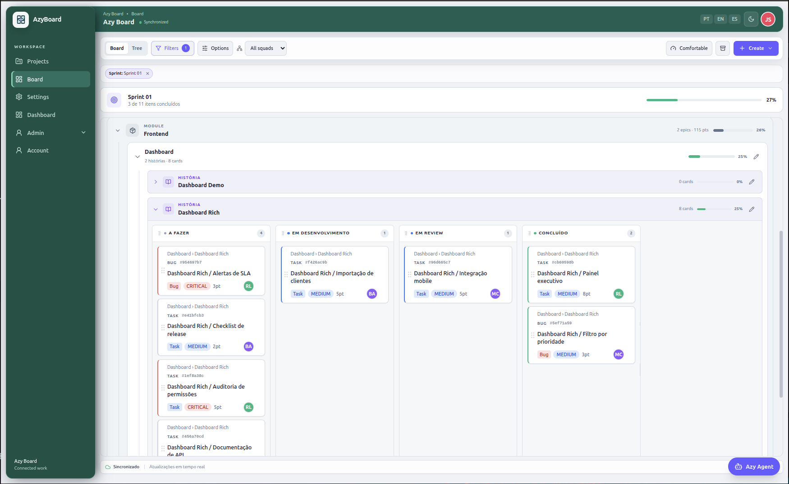
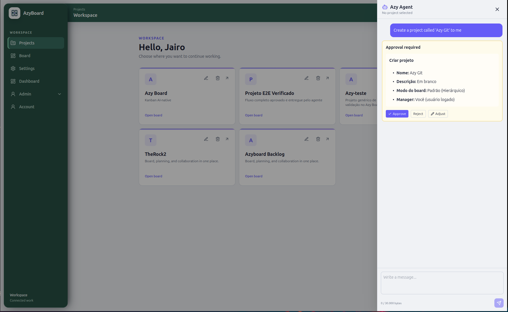
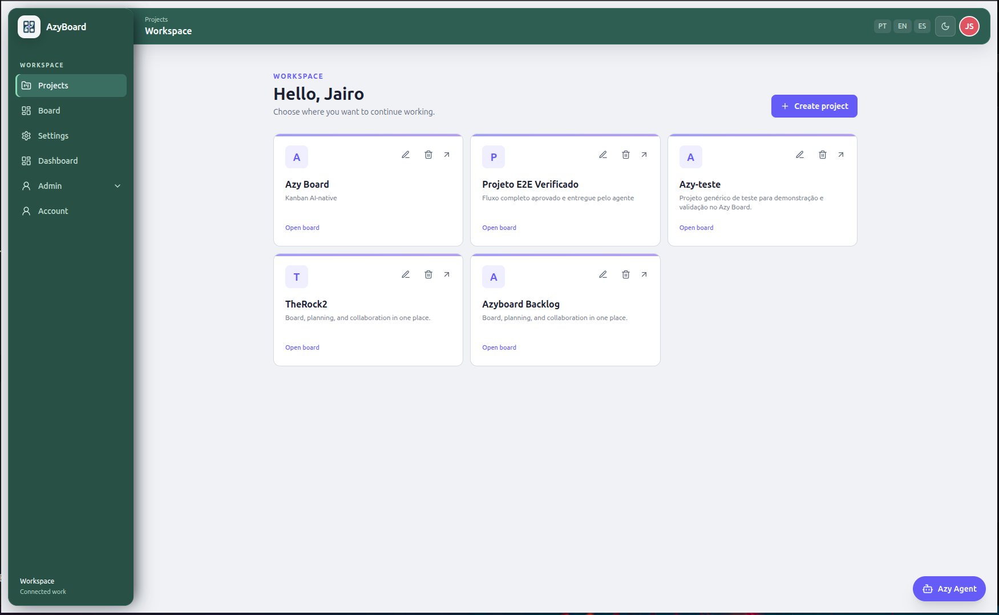
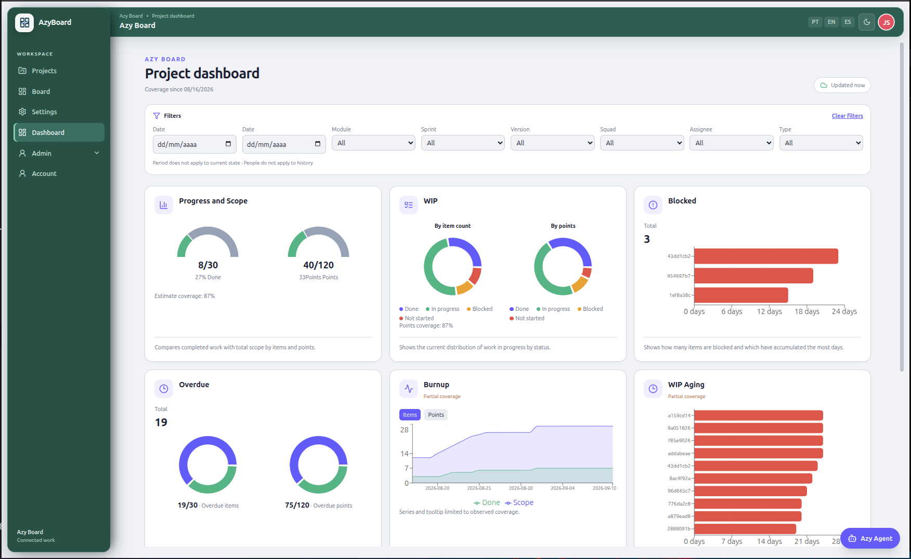
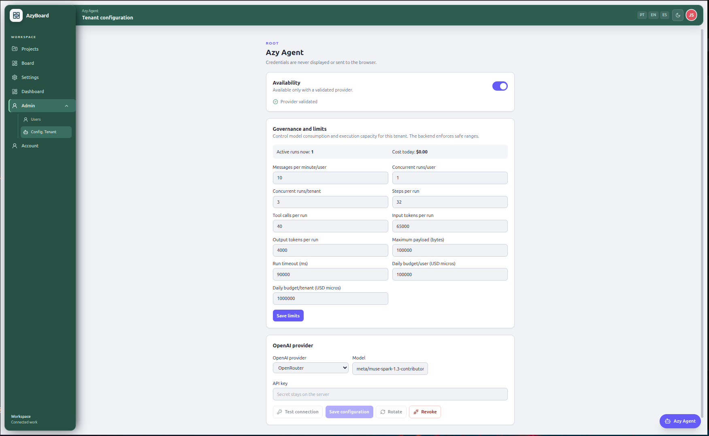
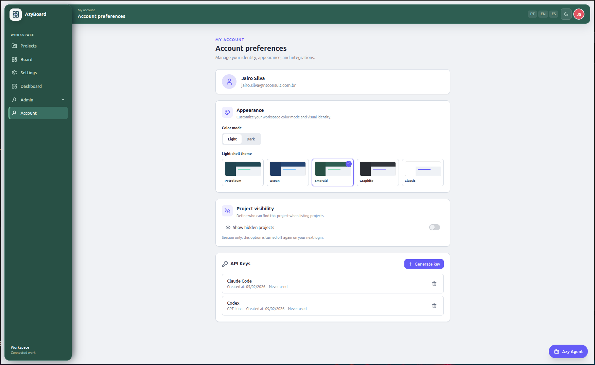
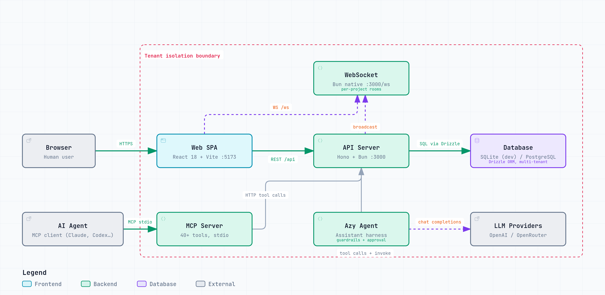
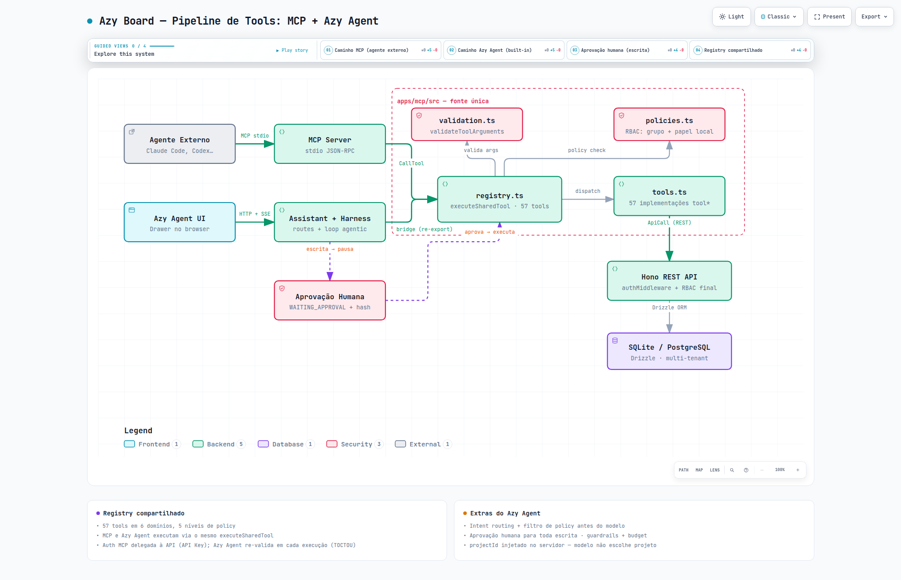

# Azy Board — The Agent-Native Project Management Hub

[](https://bun.sh)
[](https://modelcontextprotocol.io)
[](LICENSE)
[](https://www.typescriptlang.org/)

<p align="center">
  
</p>

Azy Board is a Kanban project management hub purpose-built for mixed Human-AI
teams. It treats AI agents as first-class collaborators — not integrations
bolted on top of a human-centric tool — and provides dedicated protocols for
both reading and mutating board state.

## AI by Design

Azy Board is AI by design: intelligence is not an add-on, it flows naturally
through the product. The same board that humans see is exposed to agents
through the [Model Context Protocol (MCP)](https://modelcontextprotocol.io) and
the Shadow Markdown projection, so agents read real state, act with typed
tools, and every mutation goes through human approval, RBAC and tenant
isolation. People and agents share a single source of truth — without
friction.

<p align="center">
  
</p>

### Highlights

- **Azy Agent** — built-in conversational agent: create projects, plan
  hierarchies, move cards and generate dashboards by chatting. Mutations
  require explicit human approval with a readable preview.
- **MCP native** — full REST parity through typed MCP tools, ready for Claude
  Code, Codex, OpenCode or any MCP-compatible client, plus an
  [official agent skill](skills/azyboard/SKILL.md).
- **Advanced Kanban hierarchy** — projects organize work as
  `Module → Epic → Story → Task/Bug`, with nested board lanes, collapsible
  groups and a drag-and-drop tree view.
- **Real-time collaboration** — WebSocket synchronization, per-project rooms,
  agent actions appear instantly for humans (and vice versa).
- **Project dashboard** — burnup, WIP by items/points, aging, blocked and
  overdue analytics with UTC daily series.
- **AI API keys** — per-key scopes, traceable agent identity, badges and
  audit trail for every AI action.

### A guided look

| Projects workspace | Project dashboard |
|:---:|:---:|
|  |  |

| Azy Agent tenant configuration | Account preferences |
|:---:|:---:|
|  |  |

### Sprint lifecycle

Sprints use the lifecycle `PROPOSED -> OPEN -> CLOSED`. Name, start date and end
date are required; only one sprint per project can be open at a time. Cards
already linked to a closed sprint remain available for historical filtering, but
new links are rejected by the API. The Board filter lists all sprint statuses,
while card creation lists only proposed and open sprints.

---

## Agent-Native Model

Two primary contracts define how AI agents interact with Azy Board:

### Shadow Markdown

The Shadow Markdown layer exposes a deterministic, text-first projection of the
entire board — columns, cards, owners, labels, status, priorities, ancestry
paths, and checklist progress — as a single Markdown document served through a
dedicated read endpoint.

This projection is a **compatibility contract**. Any UI change that modifies
board state must keep the Markdown output structure stable. Agents use it for:

- Summarising sprint or backlog state without UI access
- Diffing board state across time or between branches
- Providing grounded, structured context before issuing MCP commands
- Autonomous reporting, triage, and prioritisation flows

The endpoint is authenticated via API key, rate-limited, and produces output
safe for direct LLM consumption — no PII fields, no internal identifiers, no
raw stack traces.

### MCP Integration

Azy Board exposes project management operations through the
[Model Context Protocol (MCP)](https://modelcontextprotocol.io). Agents
registered with an API key can call typed MCP tools to inspect and act on
board state programmatically:

| Tool | Description |
|------|-------------|
| `list_projects` / `get_project` | Discovers projects and their configuration |
| `get_board` / `get_tree` | Reads the structured board or its tree |
| `get_shadow_markdown` | Returns the Shadow Markdown projection |
| `create_project` / `update_project` | Creates and configures projects |
| `create_task` / `update_item` | Creates and updates items and subtasks |
| `claim_task` / `release_task` | Claims or releases work |
| `move_task` / `complete_task` | Moves and completes cards |
| `archive_item` / `unarchive_item` / `delete_item` | Manages the item lifecycle |
| `create_module`, sprints, tags, and versions | Manages project planning |
| `list_members` / `list_squads` | Queries team collaboration and membership |
| `list_checklists`, logs, and tags | Records execution evidence |

The Board supports in-memory filtering by tag (selected tags use OR), version,
priority, status, and author. Different dimensions are combined with AND. The
version link is optional and stored in `items.version_id`; it can be provided
when quickly creating a TASK/BUG or through the MCP `create_task` tool.

The legacy `list_tasks` and `list_modules` tools remain available for
compatibility with already configured agents.

MCP tools are auditable, scoped to a tenant, and enforce the same RBAC rules
as the REST API. Agents cannot escalate beyond the role granted to their API
key.

> **Tip — pair MCP with the official skill:** MCP clients work best when
> combined with the [official Azy Board skill](#official-agent-skill). The
> skill loads the mandatory discovery flow, playbooks and safety rules into
> the agent, so it calls the right tools in the right order — fewer wasted
> calls, fewer conflicts and safer mutations.

### Official Agent Skill

The official, client-agnostic agent skill is maintained in
[`skills/azyboard/`](skills/azyboard/). Load `SKILL.md` into Claude Code,
OpenCode, Codex or another compatible client to receive the Azy Board MCP
playbooks and semantic slash commands. Client-specific installation guidance
is available in [`skills/azyboard/commands/README.md`](skills/azyboard/commands/README.md).

Validate the catalog, references and commands locally with:

```bash
bun run test:agent-skill
```

### Azy Agent (human chat)

The Azy Agent is disabled by default. A `ROOT` user must configure the AI
provider, a model, and a valid API key for the tenant in the administration
panel, test the connection, and enable the toggle. OpenAI and OpenRouter are
supported out of the box, and any model capable of tool use can drive the
agent — in our tests, Muse Spark (OpenRouter, free tier) performed remarkably
well. The key remains encrypted on the backend and
is never sent to the browser, chat, or logs. The Azy Agent supports only
official API keys for model
API calls. ChatGPT login credentials, Codex access tokens, and other product
tokens are not part of the assistant's credential contract.

Initial economic limits: 10 messages per minute per user, 1 active run per
user, 3 per tenant, 50 KB per message/payload, 4 steps, 8 tool calls, 45
seconds, and a daily budget of 100,000 micros per user (1,000,000 per tenant).
The Root user can monitor usage and active runs and adjust these parameters in
the tenant governance section, always within safe ranges. Runs interrupted by a
limit are recorded with an operational code; mutations require preview and
human approval. Cards, pasted text, and CSV files are untrusted data and cannot
override system rules.

The chat provides user history, clarification questions, approval,
cancellation, CSV import with preview, and a reconnectable SSE stream. Semantic
commands equivalent to the skill are: `/azyboard-status`, `/azyboard-plan`,
`/azyboard-start`, `/azyboard-update`, `/azyboard-complete`, and
`/azyboard-review`. See the [Azy Agent wiki page](docs/azyboard-wiki/09%20-%20Agentes%20e%20Integracoes/Azy%20Agent%20humano.md)
and `docs/AI_AGENT_DATA_POLICY.md` before enabling the feature.

---

## Tech Stack

| Area | Technology |
|------|-----------|
| **Frontend** | React 18, Vite 5, TypeScript 5, Tailwind CSS 3, Radix UI |
| **UI Primitives** | Lucide React, dnd-kit, Tiptap (rich text), i18next |
| **Backend** | Bun, Hono 4, TypeScript 5 |
| **Data** | Drizzle ORM — SQLite (dev) → PostgreSQL (prod) |
| **AI Protocol** | MCP SDK (`@modelcontextprotocol/sdk`), Shadow Markdown |
| **Shared Types** | `@azy-board/types` (monorepo workspace package) |
| **Realtime** | WebSocket (Bun native) |

---

## Architecture Overview

```
apps/
  api/          Hono REST + WebSocket server (Bun runtime)
  web/          React 18 SPA (Vite)
  mcp/          MCP server — AI agent protocol layer
packages/
  types/        Shared TypeScript types (ItemType, CardData, WsEvent…)
openspec/       Spec-driven change history and capability registry
```

### Runtime architecture

<p align="center">
  
</p>

The runtime architecture shows how humans and agents reach the same board
state through parallel entry points. Human traffic flows from the browser into
the React 18 SPA, which talks to the Hono API over REST (`/api`) and stays in
sync through the native Bun WebSocket (`/ws`, per-project rooms). External AI
agents connect through the MCP server (stdio transport, 40+ typed tools) and
execute mutations against the same API, authenticated by an API key that
resolves to the human owner's identity, tenant and RBAC role. The built-in Azy
Agent lives inside the API as an assistant harness: it calls LLM providers
(OpenAI/OpenRouter) with encrypted tenant credentials and executes tools
through the same shared registry, with guardrails, budgets and a human
approval gate for every non-read operation. All paths converge on the
multi-tenant database (SQLite in dev, PostgreSQL in production) accessed via
Drizzle ORM, inside a tenant isolation boundary — every server-side component
scopes every query by `tenant_id`.

### Intelligence tooling pipeline

<p align="center">
  
</p>

The intelligence layer is built on a single source of truth: `apps/mcp/src`
hosts the shared tool registry (57 tools across 6 domains), the canonical
argument validator, the authorization policy map and the transport-agnostic
tool implementations. Both entry points consume the exact same registry — the
MCP server dispatches external `CallTool` requests, while the Azy Agent
invokes it in-process through a source-level re-export bridge
(`assistantTools.ts`). Each execution goes through the same pipeline: argument
validation → policy check (global group + local project role) → tool dispatch
→ REST call into the Hono API, which remains the final RBAC enforcement point.
The Azy Agent adds an extra safety layer on top: intent routing and policy
filtering before the model even sees the tools, server-side injection of the
current project id (the model cannot target arbitrary projects), and a human
approval workflow — every write operation pauses in `WAITING_APPROVAL` and
only executes after explicit approval, with a SHA-256 hash binding the
authorized operation to the executed one (TOCTOU-safe).

**Multi-tenancy**: every table carries `tenant_id`. All queries go through a
`withTenant(tenantId)` helper. Tenants are provisioned via CLI only — no
self-signup surface.

**Leaf Rule**: only items without children (`isLeaf: true`) are movable Kanban
cards. Parent items aggregate status and points from descendants. Cascade
deletion removes all descendants, checklists, and attachments atomically.

**Nested Board lanes**: the default Kanban layout renders
`Epic → Story → Cards` with independently collapsible Epic and Story lanes.
Users can switch Stories back to card mode, hide empty Story lanes, and create
Tasks or Bugs directly inside a Story context.

**Board modes**: each project can use `HIERARCHICAL` (the default), with module,
Epic and Story lanes, or `SIMPLE`, with one fixed Story and a single Kanban flow.
Admins can convert projects between modes; conversion preserves cards and their
related data, while converting to simple removes the module/Epic structure.

**Permissions**: users have one global group, ordered as `TEAM_MEMBER`,
`MANAGER`, `ADMIN` and `ROOT`. MCP agents inherit the Owner's group, tenant,
project membership and local role. API Key scopes can only restrict access and
never grant privileges beyond the Owner.

**Ancestry Path**: each item stores a denormalised `ancestryPath` JSON column
— `[{ id, title, type }, …]` — enabling O(1) breadcrumb rendering without
recursive joins.

**Tree View progress**: the hierarchical view displays progress bars for leaf
TASK/BUG items and accumulated progress for Stories, Epics and other grouping
nodes, using only non-archived descendants in the visible filtered result.

---

## Quick Start

```bash
# 1. Install all workspace dependencies
bun install

# 2. Bootstrap the first tenant and admin user
bun run setup

# 3. Apply database migrations
bun run db:migrate

# 4. Start the API and web app
bun run dev
```

Run services individually when needed:

```bash
bun run dev:api    # Hono API on :3000
bun run dev:web    # Vite dev server on :5173
bun run dev:mcp    # MCP stdio server for configured agent clients
```

**Environment**: copy `apps/api/.env.example` to `apps/api/.env` and fill in
the required values before running `setup`. The setup requires an explicit
administrator password through its fourth argument or `ADMIN_PASSWORD`.
For MCP usage, copy
`apps/mcp/.env.example` to `apps/mcp/.env` and set an API key generated in the
web app. Never commit `.env` files.

---

## Development Checks

```bash
bun run typecheck   # tsc --noEmit across all workspaces
bun test            # Bun test runner
bun run test:integration  # API integration tests in an isolated SQLite database
bun run test:mcp          # MCP tools without external services or credentials
bun run test:mcp-catalog  # MCP catalog and authorization policies
bun run test:agent-skill   # skill, commands and references
bun run test:smoke        # HTTP smoke test; use SMOKE_URL for a published app
bun run check:i18n        # translation key parity and hardcoded-text inventory
```

### Evals (AI quality tests)

Beyond the deterministic tests above, **Azy Agent runs through eval tests**
(`evals`) — structured evaluations that measure the quality, safety and accuracy
of the model's answers against a versioned dataset, following the market best
practice of gating each release instead of trusting "it looks like it works".

- **`bun run evals`** — informal run with a full report in `tmp/eval-reports/`
  (scores per dimension, failed cases, judge justifications, dataset hash).
- **`bun run evals:gate`** — release gate. Runs on every version/tag via
  `.github/workflows/evals.yml` and fails the release when any dimension falls
  below its threshold.
- **`bun run evals:env`** — local convenience: deciphers the credential already
  in use by the local Azy Agent (`apps/api/dev.db`) into the git-ignored
  `apps/api/.env.evals`, so evals run with the exact same cheap model configured
  in the app.

Measured dimensions: task completion, tool correctness, faithfulness
(hallucination detection), scope/relevance, safety (toxicity/bias), secret-exit
leak prevention, correct refusals (e.g. requests above the action limit) and
system-prompt alignment. Deterministic code graders are used whenever ground
truth exists; an LLM-as-judge covers qualitative criteria. See `TESTING.md`.

```bash
bun run evals --filter bulk-move   # run a single case group
bun run evals --dry-run            # list cases without calling the provider
```

---

## Built with AI

This project was built entirely with AI, from architecture to code. The initial
prototypes were developed with **Claude Sonnet** (Anthropic). The rest of the
system — backend, frontend, MCP, tests, documentation and refactors — was
created with the following models:

| Model | Provider |
|-------|----------|
| **GPT-5.6 Luna** | OpenAI |
| **GLM-5.3** | Zhipu AI |
| **GLM-5.3-Flash** | Zhipu AI |
| **MiMo-V2.5-Pro** | Xiaomi |
| **DeepSeek-V4.1-Flash** | DeepSeek |
| **MiniMax-M3** | MiniMax |
| **Qwen3.8-Max** | Alibaba Cloud |

The development workflow used **OpenSpec** for change-driven specifications and
**OpenCode** as the agentic coding harness.

---

## License

Licensed under the [Business Source License 1.1](LICENSE). Free for
non-commercial use, internal business use, and self-hosted deployments.
Commercial exploitation or managed-service resale requires a separate agreement.
Converts to Apache 2.0 on **2032-04-26**.
