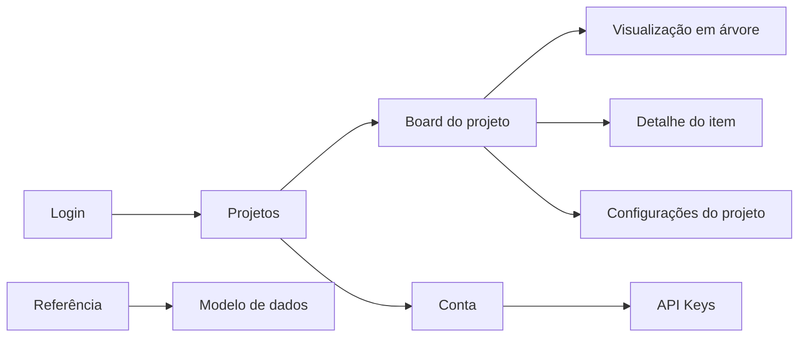

# Mapa de Navegação

## Fluxo principal

## Login

O login recebe e-mail e senha. Depois da autenticação, a pessoa é direcionada à lista de projetos ou à rota que tentou acessar anteriormente.

## Projetos

A lista de projetos permite abrir um projeto existente ou criar um novo. O menu do perfil dá acesso à conta, à alternância de projetos ocultos e à opção de sair.

## Board do projeto

A barra lateral do projeto contém:

- Marca **Azy Board**, com retorno aos projetos.
- **Projetos**, **Board**, **Dashboard**, **Configurações** (conforme permissões), **Administração** (Admin e Root) e **Conta**.

O cabeçalho contextual identifica o projeto e a seção atual e reúne seletor de idioma, tema e menu do perfil.

A barra de comandos contém a alternância entre Kanban e árvore, os painéis de filtros e opções, itens arquivados e o menu de criação.

## Detalhes dos itens

Épicos, histórias, tasks e bugs possuem experiências de edição adequadas ao tipo. Tasks e bugs também oferecem checklists, histórico e navegação entre subtasks.

## Configurações

As configurações são acessadas pela barra lateral e permanecem no contexto do projeto. As ações administrativas disponíveis dependem do grupo global e do papel do usuário.

## Conta

A conta é acessada pelo menu do perfil. Ela apresenta os dados pessoais e o gerenciamento das API Keys usadas por agentes.

## Referência e modelo de dados

A área de referência reúne o glossário, as matrizes funcionais e o [[10 - Referencia/Modelo de Dados|mapa do modelo de dados]]. O mapa parte de uma visão ER global e abre os domínios de identidade, projeto, itens, entidades complementares e integridade.
