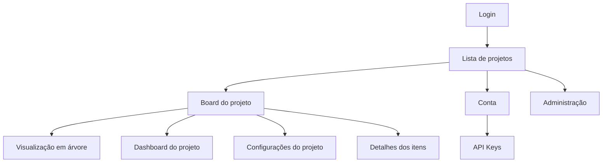

# Navegação Global

A navegação do Azy Board é organizada em uma casca integrada: uma **barra lateral fixa** com as áreas principais, um **cabeçalho contextual** que identifica o local atual e uma **barra de comandos** específica de cada tela.

## Áreas principais

## Barra lateral

A barra lateral fica fixa à esquerda nas telas protegidas e concentra a navegação:

- Marca **Azy Board** no topo, com retorno à lista de projetos.
- **Projetos**, sempre disponível.
- **Board**, quando há um projeto em contexto.
- **Configurações**, quando o grupo global da conta permite configurar o projeto atual.
- **Dashboard**, quando há um projeto em contexto.
- **Administração**, para Admin e Root, com o submenu **Usuários** — e, para Root, **Config. Tenant**.
- **Conta**, no fim da lista.

Em telas estreitas, a barra lateral vira um menu de gaveta acionado por um botão. No desktop, ela pode ficar recolhida em modo de ícones, com nomes apresentados por tooltip.

## Cabeçalho contextual

O cabeçalho não repete a navegação: ele identifica o contexto e reúne preferências.

- Na lista de projetos, apresenta o título da área.
- Dentro de um projeto, apresenta **Nome do projeto • seção atual** (por exemplo, **Portal do Cliente • Board**). Nomes longos são truncados com o nome completo disponível por tooltip.
- À direita, ficam o seletor de idioma (oculto em telas muito estreitas), o alternador de tema e o menu do perfil.

## Barra de comandos

Cada tela oferece sua própria barra de comandos abaixo do cabeçalho. No Board, ela contém a alternância segmentada entre **Kanban** e **Árvore**, os painéis **Filtros** e **Opções**, o seletor rápido de squad, a densidade e o menu **Criar**. Os detalhes estão em [[04 - Board e Visualizacoes/Conhecer o Board|Conhecer o Board]].

## Alternar entre Kanban e árvore

1. Abra o Board de um projeto.
2. Na barra de comandos, selecione **Kanban** ou **Árvore**.
3. O conteúdo principal é substituído sem sair do projeto.

Os filtros compatíveis são preservados durante a troca. Controles específicos do Kanban, como expandir ou recolher swimlanes, aparecem somente quando fazem sentido.

## Abrir as configurações do projeto

1. Na barra lateral, selecione **Configurações**.
2. A aplicação abre as configurações do projeto atual.
3. Use a barra lateral para retornar ao Board ou a outra área.

As seções e ações dependem do grupo global e do papel local da pessoa. Membros de Equipe não veem Configurações; Gerentes, Admins e Root veem as configurações dos projetos em contexto. Administração aparece somente para Admin e Root.

## Usar o menu do perfil

1. Selecione o avatar no canto direito do cabeçalho.
2. Escolha uma das opções:
   - **Configurações da conta** para abrir a conta e as API Keys.
   - **Mostrar projetos ocultos** para alternar a preferência da sessão.
   - **Sair** para encerrar a sessão.
3. Clique fora do menu para fechá-lo sem navegar.

## Navegar pela conta

A tela da conta usa a mesma barra lateral e reúne perfil, tema, temas claros, idioma, projetos ocultos e API Keys. A conta não pertence a um projeto específico.

## Modais e navegação contextual

Algumas tarefas são realizadas sem trocar de página:

- Criação de projeto.
- Criação e edição de épicos e histórias.
- Detalhes de tasks e bugs.
- Histórico de atividades.
- Itens arquivados.
- Consulta e edição de versões.

Fechar uma modal retorna ao contexto anterior. Em itens com filhos, a navegação entre modais mantém uma pilha e oferece a ação **Voltar**.

## Regras e comportamentos

- O projeto atual permanece identificado no cabeçalho.
- A troca entre Kanban e árvore não altera o projeto.
- O acesso às configurações sempre usa o projeto atual.
- Tema e idioma podem ser alterados nas principais telas.
- O menu do perfil é fechado ao selecionar uma opção ou clicar fora dele.
- Rotas desconhecidas retornam à lista de projetos.

## Permissões

| Área | Membro de Equipe | Gerente | Admin e Root |
|---|---:|---:|---:|
| Lista de projetos | Associados | Associados | Todos do tenant, exceto restritos sem participação |
| Board, árvore e Dashboard | Sim | Sim | Sim |
| Configurações do projeto | Não | Sim, nos projetos em contexto | Sim, nos projetos em contexto |
| Administração de usuários | Não | Não | Sim |
| Conta e preferências | Sim | Sim | Sim |

A visibilidade de itens do menu acompanha o grupo global da conta e é aplicada também no servidor; esconder um item de menu não substitui a autorização da API.

## Exemplo prático

Uma pessoa abre o projeto **Portal do Cliente**, alterna para a árvore para conferir a hierarquia e retorna ao Kanban. Em seguida, abre as configurações pela barra lateral, consulta uma versão e volta ao mesmo Board.

## Funcionalidades relacionadas

- [[00 - Inicio/Mapa de Navegacao|Mapa de navegação]]
- [[01 - Acesso e Navegacao/Entrar e Manter a Sessao|Entrar e manter a sessão]]
- [[04 - Board e Visualizacoes/Board e Visualizacoes|Board e Visualizações]]
- [[08 - Conta e Preferencias/Conta e Preferencias|Conta e Preferências]]

<strong>Como funciona tecnicamente</strong>

### Rotas

A interface utiliza rotas para login, projetos, Board, configurações de projeto, Dashboard, Administração e conta. As rotas funcionais são carregadas sob demanda para reduzir o conteúdo inicial necessário.

### Proteção

Um componente de proteção aguarda a resolução da sessão antes de renderizar páginas privadas. Usuários sem sessão são enviados ao login. Rotas não reconhecidas são normalizadas para a lista de projetos.

### Estado de navegação

O identificador do projeto faz parte da rota. Alternâncias locais, modais, filtros e swimlanes são controlados pela página do Board, sem criar rotas adicionais para cada estado visual.

