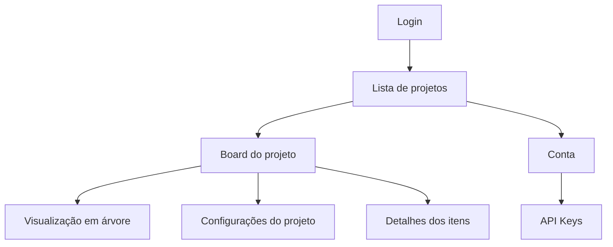

# Navegação Global

A navegação do Azy Board mantém os principais destinos no cabeçalho e utiliza breadcrumbs para indicar o contexto atual.

## Áreas principais

## Cabeçalho da lista de projetos

Na lista de projetos, o cabeçalho apresenta:

- Marca **Azy Board**.
- Seletor de idioma.
- Controle de tema.
- Avatar e menu do perfil.

O conteúdo central apresenta os projetos e a ação de criação.

## Cabeçalho do Board

Ao abrir um projeto, o cabeçalho passa a apresentar o contexto do trabalho atual:

- Marca com retorno à lista de projetos.
- Breadcrumb **Projetos > Board · Nome do projeto**.
- Controle segmentado entre **Kanban** e **Árvore**.
- Seletor de idioma.
- Controle de tema.
- Acesso às configurações do projeto.
- Menu do perfil.

O nome do projeto no breadcrumb ajuda a diferenciar o contexto quando a pessoa participa de vários projetos.

## Alternar entre Kanban e árvore

1. Abra o Board de um projeto.
2. No cabeçalho, selecione **Kanban** ou **Árvore**.
3. O conteúdo principal é substituído sem sair do projeto.

Os filtros compatíveis são preservados durante a troca. Controles específicos do Kanban, como expandir ou recolher swimlanes, aparecem somente quando fazem sentido.

## Abrir as configurações do projeto

1. No cabeçalho do Board, selecione o controle de configurações.
2. A aplicação abre as configurações do projeto atual.
3. Use **Voltar ao board** para retornar.

As seções e ações administrativas dependem do papel da pessoa no projeto.

## Usar o menu do perfil

1. Selecione o avatar no canto direito do cabeçalho.
2. Escolha uma das opções:
   - **Configurações da conta** para abrir a conta e as API Keys.
   - **Sair** para encerrar a sessão.
3. Clique fora do menu para fechá-lo sem navegar.

## Navegar pela conta

A tela da conta apresenta um link de retorno a **Projetos**, além dos controles de idioma e tema. A conta não pertence a um projeto específico.

## Modais e navegação contextual

Algumas tarefas são realizadas sem trocar de página:

- Criação de projeto.
- Criação e edição de épicos e histórias.
- Detalhes de tasks e bugs.
- Histórico de atividades.
- Itens arquivados.
- Consulta e edição de versões.

Fechar uma modal retorna ao contexto anterior. Em itens com filhos, a navegação entre modais mantém uma pilha e oferece a ação **Voltar**.

## Regras e comportamentos

- O projeto atual permanece identificado no cabeçalho.
- A troca entre Kanban e árvore não altera o projeto.
- O acesso às configurações sempre usa o projeto atual.
- Tema e idioma podem ser alterados nas principais telas.
- O menu do perfil é fechado ao selecionar uma opção ou clicar fora dele.
- Rotas desconhecidas retornam à lista de projetos.

## Permissões

| Área | Admin | Membro | Visualizador |
|---|---:|---:|---:|
| Lista de projetos | Sim | Sim | Sim |
| Board e árvore | Sim | Sim | Sim |
| Conta e preferências | Sim | Sim | Sim |
| Configurações do projeto | Sim | Consulta | Consulta |
| Ações administrativas | Sim | Não | Não |

## Exemplo prático

Uma pessoa abre o projeto **Portal do Cliente**, alterna para a árvore para conferir a hierarquia e retorna ao Kanban. Em seguida, abre as configurações, consulta uma versão e volta ao mesmo Board pelo link do cabeçalho.

## Funcionalidades relacionadas

- [[00 - Inicio/Mapa de Navegacao|Mapa de navegação]]
- [[01 - Acesso e Navegacao/Entrar e Manter a Sessao|Entrar e manter a sessão]]
- [[04 - Board e Visualizacoes/Board e Visualizacoes|Board e Visualizações]]
- [[08 - Conta e Preferencias/Conta e Preferencias|Conta e Preferências]]

<strong>Como funciona tecnicamente</strong>

### Rotas

A interface utiliza rotas para login, projetos, Board, configurações de projeto e conta. As rotas funcionais são carregadas sob demanda para reduzir o conteúdo inicial necessário.

### Proteção

Um componente de proteção aguarda a resolução da sessão antes de renderizar páginas privadas. Usuários sem sessão são enviados ao login. Rotas não reconhecidas são normalizadas para a lista de projetos.

### Estado de navegação

O identificador do projeto faz parte da rota. Alternâncias locais, modais, filtros e swimlanes são controlados pela página do Board, sem criar rotas adicionais para cada estado visual.

