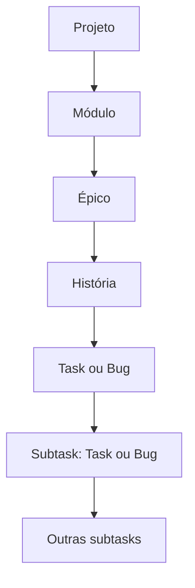

# Hierarquia dos Itens

O Azy Board organiza todo o trabalho em uma árvore contínua. Cada nível acrescenta contexto e conecta objetivos amplos a atividades executáveis.

## Estrutura completa



## Projeto

O projeto é o limite principal de organização. Ele reúne:

- Board e visualização em árvore.
- Estrutura de itens.
- Participantes e squads.
- Colunas, módulos, sprints e versões.
- Tags, centros de custo e integrações.

Um item nunca pertence a mais de um projeto.

## Módulo

O módulo representa uma área funcional ou divisão de alto nível. Exemplos:

- Autenticação.
- Catálogo.
- Pagamentos.
- Relatórios.

Módulos contêm épicos. Eles não são cards e não possuem status operacional.

## Épico

O épico representa um objetivo amplo dentro de um módulo. No Kanban, ele funciona como a lane principal que contém as lanes de suas histórias.

Um épico:

- Pertence diretamente a um módulo.
- Pode possuir várias histórias.
- Pode ser associado a uma versão.
- Consolida o contexto, pontos e progresso dos descendentes.

## História

A história descreve uma necessidade funcional. Ela pertence a um épico e pode incluir narrativa ágil, critérios de aceitação e notas.

Uma história pode:

- Conter tasks e bugs.
- Formar uma lane horizontal dentro do épico, com suas próprias colunas e cards.
- Ser expandida ou recolhida independentemente do épico.
- Funcionar como card móvel quando não possui filhos e o modo **Histórias como cards** está ativo.

## Task e bug

Tasks e bugs representam trabalho operacional:

- `Task`: atividade necessária para produzir um resultado.
- `Bug`: defeito ou comportamento incorreto que precisa ser corrigido.

Eles podem ser vinculados diretamente a uma história ou existir sem pai. Também podem conter outras tasks e bugs.

## Subtask

Subtask é o nome funcional de uma task ou bug criada abaixo de outra task ou bug. Não existe um tipo separado chamado subtask.

Essa estrutura permite decompor o trabalho em vários níveis. Recomenda-se limitar a profundidade para que a navegação continue compreensível.

## Relações permitidas

| Item | Pai esperado | Pode ter filhos |
|---|---|---:|
| Módulo | Projeto | Sim, épicos |
| Épico | Módulo | Sim, histórias |
| História | Épico | Sim, tasks e bugs |
| Task | História, task, bug ou nenhum pai | Sim, tasks e bugs |
| Bug | História, task, bug ou nenhum pai | Sim, tasks e bugs |

## Itens sem pai operacional

Uma task ou bug sem história ou item pai é considerado órfão. No Board, itens sem épico são reunidos em **Sem épico**. Quando existe um épico ancestral, mas não uma história ancestral, o item aparece no agrupamento **Sem história** daquele épico.

Itens órfãos são úteis para triagem inicial, mas vinculá-los a uma história melhora o contexto e os relatórios.

## Breadcrumb

O breadcrumb de um card mostra seus ancestrais. Um exemplo de caminho é:

```text
Pagamentos > Cobrança recorrente > Renovar assinatura > Validar cartão
```

Quando o caminho é longo, o card apresenta uma versão abreviada. Posicionar o cursor sobre o breadcrumb revela o caminho completo.

Ao renomear um ancestral, o caminho dos descendentes é atualizado para manter a hierarquia coerente.

## Como alterar o contexto de um item

- Edite o módulo de um épico.
- Edite o épico pai de uma história.
- Edite a história pai de uma task ou bug.
- Crie uma subtask a partir do detalhe de uma task ou bug.

Alterar o pai modifica o breadcrumb e o agrupamento do item no Board e na árvore.

## Permissões

| Ação | Admin | Membro | Visualizador |
|---|---:|---:|---:|
| Consultar a hierarquia | Sim | Sim | Sim |
| Criar e editar itens | Sim | Sim | Não |
| Gerenciar módulos | Sim | Não | Não |

## Exemplo prático

No projeto **Portal do Cliente**, o módulo **Pagamentos** contém o épico **Cobrança recorrente**. A história **Renovar assinatura** contém a task **Processar renovação**, que foi dividida nas subtasks **Validar cartão** e **Registrar cobrança**.

## Funcionalidades relacionadas

- [[03 - Estrutura do Trabalho/Leaf Rule e Itens Agregadores|Leaf Rule e itens agregadores]]
- [[03 - Estrutura do Trabalho/Pontos e Progresso|Pontos e progresso]]
- [[04 - Board e Visualizacoes/Conhecer o Board|Conhecer o Board]]

<details>
<summary><strong>Como funciona tecnicamente</strong></summary>

### Modelo unificado

Épicos, histórias, tasks e bugs são registros da mesma entidade de item. O tipo determina os campos e as relações válidas. Módulos são entidades próprias associadas ao projeto.

### Relação e ancestry path

O campo de pai cria o autorrelacionamento entre itens. Além dessa relação, cada item mantém um caminho desnormalizado de ancestrais para renderizar breadcrumbs sem consultas recursivas a cada card.

### Validação

A API valida tipo, projeto, tenant e pai antes de criar ou mover relações. Mudanças de título ou pai atualizam o ancestry path dos descendentes em cascata.

</details>
