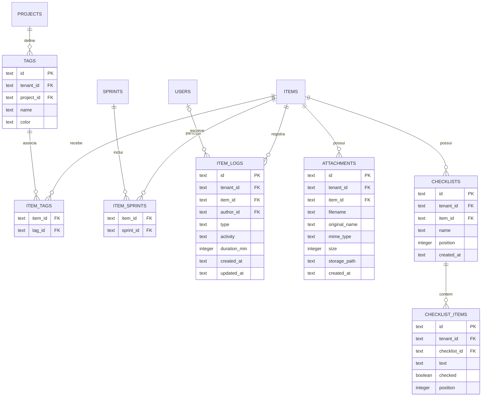
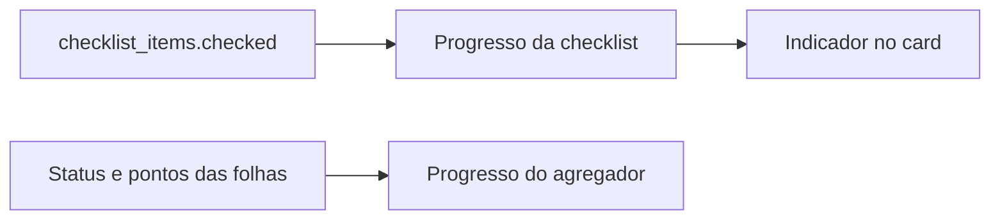

# Modelo - Entidades Complementares

Itens recebem classificação, planejamento, conteúdo e auditoria por entidades complementares. Algumas são relações muitos para muitos; outras pertencem diretamente ao item.

## Diagrama

## `tags`

Catálogo de etiquetas de um projeto.

| Campo | Obrigatório | Descrição |
|---|---:|---|
| `id` | Sim | UUID e chave primária. |
| `tenant_id` | Sim | Tenant da tag. |
| `project_id` | Sim | Projeto proprietário. |
| `name` | Sim | Nome exibido nos chips e filtros. |
| `color` | Sim | Cor hexadecimal; padrão `#6366f1`. |

Uma tag pode classificar vários itens e um item pode possuir várias tags.

## `item_tags`

Tabela associativa entre `items` e `tags`.

| Campo | Obrigatório | Descrição |
|---|---:|---|
| `item_id` | Sim | Item classificado. |
| `tag_id` | Sim | Tag associada. |

Não possui ID próprio porque a relação é identificada funcionalmente pelo par item e tag. O schema atual não declara chave primária composta nem índice único para esse par; a aplicação deve evitar associações duplicadas.

Excluir uma tag remove primeiro suas linhas em `item_tags`. Excluir um item também remove manualmente suas associações.

## `item_sprints`

Tabela associativa entre `items` e `sprints`.

| Campo | Obrigatório | Descrição |
|---|---:|---|
| `item_id` | Sim | Item planejado. |
| `sprint_id` | Sim | Sprint associada. |

A relação muitos para muitos permite preservar a participação do item em diferentes ciclos. O par `(item_id, sprint_id)` é protegido por um índice físico único, que impede associações duplicadas no banco.

## `item_logs`

Histórico automático e manual de um item.

| Campo | Obrigatório | Descrição |
|---|---:|---|
| `id` | Sim | UUID e chave primária. |
| `tenant_id` | Sim | Tenant do registro. |
| `item_id` | Sim | Item auditado. |
| `author_id` | Não | Usuário responsável pelo registro. |
| `type` | Sim | `auto` ou `manual`. |
| `activity` | Sim | Texto que descreve a atividade. |
| `duration_min` | Não | Tempo trabalhado em minutos. |
| `actor_type` | Não | Origem do autor: `HUMAN`, `AGENT`, `SYSTEM` ou `UNKNOWN`. |
| `actor_label` | Não | Rótulo exibível do autor, útil para identificar agentes. |
| `source` | Não | Canal da ação: `REST`, `MCP`, `SYSTEM` ou `UNKNOWN`. |
| `created_at` | Sim | Data de criação. |
| `updated_at` | Sim | Data da última edição. |

Logs automáticos representam mudanças do sistema e não são editáveis. Logs manuais podem conter duração e ser alterados pelo fluxo permitido.

A foreign key de `item_id` usa `ON DELETE CASCADE`. A migration cria um índice composto por `(tenant_id, item_id, type, created_at)` para acelerar histórico e isolamento.

## `attachments`

Metadados dos arquivos anexados.

| Campo | Obrigatório | Descrição |
|---|---:|---|
| `id` | Sim | UUID e chave primária. |
| `tenant_id` | Sim | Tenant do arquivo. |
| `item_id` | Sim | Item proprietário. |
| `filename` | Sim | Nome físico gerado para armazenamento. |
| `original_name` | Sim | Nome enviado pelo usuário. |
| `mime_type` | Sim | Tipo MIME. |
| `size` | Sim | Tamanho em bytes. |
| `storage_path` | Sim | Caminho local ou chave do objeto. |
| `created_at` | Sim | Data do upload. |

O conteúdo binário não fica no banco. `storage_path` aponta para o storage e os demais campos suportam exibição, validação e download.

A remoção coordenada precisa excluir o objeto físico e o registro. Na exclusão em cascata de itens, a aplicação remove os metadados explicitamente; o schema não declara `ON DELETE CASCADE` nessa relação.

## `checklists`

Listas nomeadas dentro de um item.

| Campo | Obrigatório | Descrição |
|---|---:|---|
| `id` | Sim | UUID e chave primária. |
| `tenant_id` | Sim | Tenant da lista. |
| `item_id` | Sim | Item proprietário. |
| `name` | Sim | Título da checklist. |
| `position` | Sim | Ordem entre listas. |
| `created_at` | Sim | Data de criação. |

`item_id` usa `ON DELETE CASCADE`, portanto a remoção do item também remove suas checklists no banco.

## `checklist_items`

Passos individuais de uma checklist.

| Campo | Obrigatório | Descrição |
|---|---:|---|
| `id` | Sim | UUID e chave primária. |
| `tenant_id` | Sim | Tenant do passo. |
| `checklist_id` | Sim | Checklist proprietária. |
| `text` | Sim | Descrição verificável. |
| `checked` | Sim | Conclusão; armazenada como inteiro booleano no SQLite. |
| `position` | Sim | Ordem dentro da lista. |

`checklist_id` usa `ON DELETE CASCADE`. O progresso é calculado contando itens marcados e total de itens; não existe coluna persistida de percentual.

## Dependência e compartilhamento

| Entidade | Compartilhada no projeto | Dependente do item |
|---|---:|---:|
| Tag | Sim | Não |
| Sprint | Sim | Não |
| `item_tags` | Não | Sim |
| `item_sprints` | Não | Sim |
| Log | Não | Sim |
| Anexo | Não | Sim |
| Checklist | Não | Sim |
| Item de checklist | Não | Indiretamente |

## Progresso derivado

O progresso de checklist e o progresso hierárquico são cálculos distintos. Nenhum deles exige uma coluna de percentual persistida.

## Funcionalidades relacionadas

- [[10 - Referencia/Modelo de Dados|Modelo de dados]]
- [[06 - Tasks Bugs e Subtasks/Tags|Tags]]
- [[06 - Tasks Bugs e Subtasks/Checklists|Checklists]]
- [[06 - Tasks Bugs e Subtasks/Anexos|Anexos]]
- [[06 - Tasks Bugs e Subtasks/Historico de Atividades e Tempo Trabalhado|Histórico de atividades e tempo trabalhado]]
- [[07 - Configuracoes do Projeto/Gerenciar Sprints|Gerenciar sprints]]

