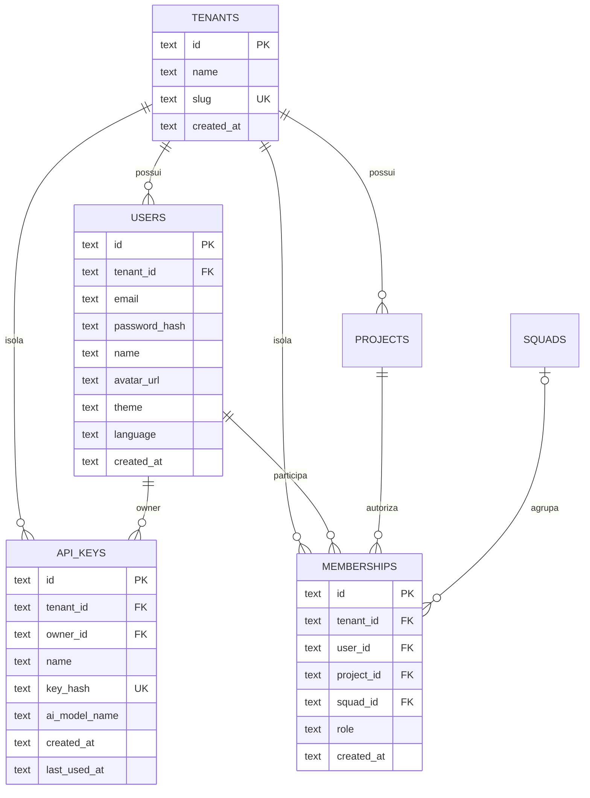
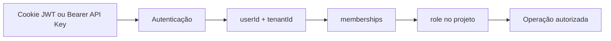

# Modelo - Identidade e Acesso

Este domínio define o isolamento organizacional, as contas humanas, as credenciais de agentes e a autorização por projeto.

## Diagrama

## `tenants`

Raiz do isolamento multi-tenant.

| Campo | Obrigatório | Descrição |
|---|---:|---|
| `id` | Sim | UUID e chave primária. |
| `name` | Sim | Nome da organização ou workspace. |
| `slug` | Sim | Identificador textual único do tenant. |
| `created_at` | Sim | Data de criação. |

Um tenant possui usuários, projetos e todos os demais dados de negócio. O contexto autenticado sempre resolve um único `tenant_id`.

## `users`

Representa uma conta humana.

| Campo | Obrigatório | Descrição |
|---|---:|---|
| `id` | Sim | UUID e chave primária. |
| `tenant_id` | Sim | Tenant ao qual a conta pertence. |
| `email` | Sim | Identificador usado no login e na inclusão em projetos. |
| `password_hash` | Sim | Hash da senha; a senha original não é persistida. |
| `name` | Sim | Nome exibido na aplicação. |
| `avatar_url` | Não | Endereço da imagem de perfil. |
| `global_group` | Sim | Grupo global: `TEAM_MEMBER`, `MANAGER`, `ADMIN` ou `ROOT`. |
| `theme` | Sim | `light` ou `dark`. |
| `light_shell_theme` | Não | Preset do tema claro: `petroleum`, `ocean`, `emerald`, `graphite` ou `classic`. |
| `language` | Sim | `pt-BR`, `en` ou `es`. |
| `created_at` | Sim | Data de criação. |

O usuário pode ser autor, responsável, gerente de projeto, autor de atividade e proprietário de API Keys. O grupo global define o escopo de navegação e administração.

## `api_keys`

Credenciais pessoais para agentes e integrações.

| Campo | Obrigatório | Descrição |
|---|---:|---|
| `id` | Sim | UUID e chave primária. |
| `tenant_id` | Sim | Tenant resolvido na autenticação. |
| `owner_id` | Sim | Usuário humano proprietário. |
| `name` | Sim | Nome funcional da credencial. |
| `key_hash` | Sim | SHA-256 do segredo, único globalmente. |
| `ai_model_name` | Não | Nome ou modelo do agente. |
| `project_scope` | Não | Lista de projetos permitidos; vazia significa sem restrição adicional. |
| `permission_scope` | Não | Lista de permissões permitidas: `read`, `write`, `admin` ou `delete`. |
| `expires_at` | Não | Data de expiração opcional. |
| `revoked_at` | Não | Data de revogação, quando aplicada. |
| `created_at` | Sim | Data de criação. |
| `last_used_at` | Não | Última autenticação registrada. |

O segredo integral existe somente na criação. Em um `claim`, `items.assignee_api_key_id` identifica qual agente operou em nome do proprietário. Escopos e expiração apenas restringem o acesso herdado do proprietário; a interface atual expõe nome e modelo, e os demais campos são suportados pela API.

## `memberships`

Associação que concede acesso de um usuário a um projeto.

| Campo | Obrigatório | Descrição |
|---|---:|---|
| `id` | Sim | UUID e chave primária. |
| `tenant_id` | Sim | Tenant da associação. |
| `user_id` | Sim | Usuário participante. |
| `project_id` | Sim | Projeto acessível. |
| `squad_id` | Não | Squad atual dentro do projeto. |
| `role` | Sim | `ADMIN`, `MEMBER` ou `VIEWER`. |
| `created_at` | Sim | Data de inclusão. |

`memberships` resolve uma relação muitos para muitos entre usuários e projetos e acrescenta atributos próprios: papel e squad.

## Fluxo de autenticação e autorização

1. Sessão ou API Key resolve o usuário e o tenant.
2. A rota procura `memberships` pelo trio tenant, usuário e projeto.
3. O papel é comparado ao mínimo necessário.
4. Sem associação, a API responde como recurso não encontrado.

## Regras de domínio

- Uma API Key sempre possui um proprietário humano.
- O papel pertence à associação com o projeto, não ao usuário global.
- Um membership pode apontar para no máximo um squad.
- O squad precisa pertencer ao mesmo projeto da associação.
- Credenciais de agentes herdam as permissões do proprietário.
- A aplicação deve impedir associações duplicadas do mesmo usuário ao mesmo projeto.

## Relações com outros domínios

- `projects.manager_user_id` identifica um gerente, sem conceder RBAC adicional.
- `items.author_id` registra quem criou o item.
- `items.assignee_id` registra quem executa.
- `item_logs.author_id` identifica o autor de uma atividade.

## Funcionalidades relacionadas

- [[10 - Referencia/Modelo de Dados|Modelo de dados]]
- [[07 - Configuracoes do Projeto/Gerenciar Membros e Papeis|Gerenciar membros e papéis]]
- [[08 - Conta e Preferencias/Gerenciar API Keys|Gerenciar API Keys]]
- [[10 - Referencia/Perfis e Permissoes|Perfis e permissões]]

