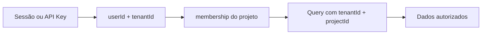
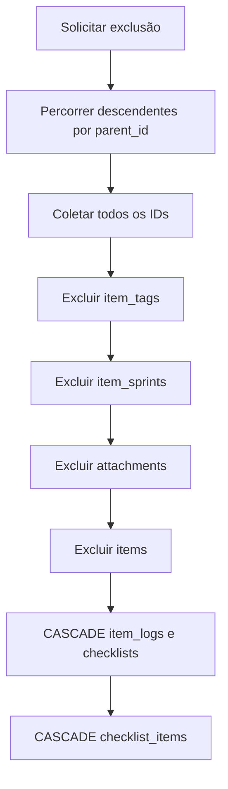

# Modelo - Integridade e Cascatas

O Azy Board combina constraints do SQLite, relações do Drizzle e validações nas rotas. Entender essa divisão é essencial para manutenção, migração de banco e integrações que escrevem dados.

## Níveis de garantia

| Nível | Exemplo | Responsabilidade |
|---|---|---|
| Constraint física | `items.project_id -> projects.id` | Banco rejeita referência inexistente. |
| Relação ORM | `items.parent` e `items.children` | Drizzle permite consultas relacionais. |
| Regra transacional | Transferir cards antes de excluir coluna | Serviço coordena múltiplas alterações. |
| Regra de domínio | História deve ser filha de épico | API valida tipo e contexto. |
| Isolamento | Todas as consultas filtram `tenant_id` | Middleware e handlers impedem acesso cruzado. |

Uma relação declarada no ORM não cria automaticamente uma foreign key. Da mesma forma, possuir foreign keys isoladas não garante que as duas pontas pertençam ao mesmo tenant ou projeto.

## Constraints físicas relevantes

| Origem | Destino | Exclusão declarada |
|---|---|---|
| `users.tenant_id` | `tenants.id` | `NO ACTION` |
| `api_keys.owner_id` | `users.id` | `NO ACTION` |
| `memberships.user_id` | `users.id` | `NO ACTION` |
| `memberships.project_id` | `projects.id` | `NO ACTION` |
| `memberships.squad_id` | `squads.id` | `NO ACTION` |
| Entidades de projeto | `projects.id` | Em geral `NO ACTION` |
| `project_versions.project_id` | `projects.id` | `CASCADE` |
| `items.project_id` | `projects.id` | `NO ACTION` |
| `items.module_id` | `modules.id` | `NO ACTION` |
| `items.column_id` | `columns.id` | `NO ACTION` |
| `items.version_id` | `project_versions.id` | `SET NULL` na migration |
| `item_logs.item_id` | `items.id` | `CASCADE` |
| `checklists.item_id` | `items.id` | `CASCADE` |
| `checklist_items.checklist_id` | `checklists.id` | `CASCADE` |
| `attachments.item_id` | `items.id` | `NO ACTION` |
| `item_tags.item_id` | `items.id` | `NO ACTION` |
| `item_sprints.item_id` | `items.id` | `NO ACTION` |

O schema TypeScript não repete `onDelete: 'set null'` em `items.version_id`, embora a migration que criou a coluna possua essa ação. A rota de versões também limpa o vínculo explicitamente, reduzindo dependência dessa diferença.

## Unicidade física

O banco declara unicidade para:

- `tenants.slug`;
- `api_keys.key_hash`;
- associação única entre item e sprint (`item_sprints_item_sprint_unique`);
- sequência de eventos por run (`assistant_events_tenant_run_sequence_unique`);
- hash de operação por run (`assistant_approvals_run_operation_hash_unique`);
- par ciclo e item (`sprint_cycle_items_unique`).

Outras unicidades funcionais dependem da aplicação ou ainda precisam de constraints explícitas:

- e-mail dentro do tenant;
- um membership por usuário e projeto;
- código de centro de custo por projeto;
- associação única entre item e tag;
- somente uma sprint `OPEN` por projeto.

## Isolamento multi-tenant

Princípios aplicados:

1. Sessão e API Key resolvem o tenant no servidor.
2. O cliente não escolhe um `tenant_id` arbitrário.
3. Rotas de projeto verificam membership.
4. Queries sensíveis combinam `tenant_id` com o identificador do recurso.
5. A ausência de acesso retorna `404` para não revelar recursos externos.

As foreign keys usam IDs simples. Portanto, a coerência cross-tenant de relações como item, coluna, módulo ou centro de custo depende também da validação da aplicação.

## Exclusão de item

A travessia é feita em largura para incluir toda a árvore. Como `parent_id` não possui foreign key, todos os itens podem ser removidos juntos depois que as dependências sem cascade forem limpas.

O arquivo físico de cada anexo também precisa ser removido do storage. A exclusão do registro, sozinha, não elimina o objeto armazenado.

## Outras operações destrutivas

| Recurso | Regra antes da remoção |
|---|---|
| Coluna | Transferir os cards para outra coluna. |
| Módulo vazio | Excluir diretamente. |
| Módulo com épicos | Transferir os épicos ou excluir toda a árvore. |
| Squad | Definir `memberships.squad_id = null`. |
| Tag | Excluir associações em `item_tags`. |
| Versão | Definir `items.version_id = null`. |
| Centro de custo | Bloquear enquanto houver itens associados. |
| Checklist | `CASCADE` remove seus itens. |
| API Key | Revogar sem revelar credenciais de terceiros; itens históricos devem preservar ou limpar a referência de forma controlada. |

## Arquivamento não é exclusão

O arquivamento preserva registros e relações:

1. coleta item e descendentes;
2. copia cada `status` para `status_before_archive`;
3. define `status = ARCHIVED`;
4. oculta os itens das consultas normais.

Na restauração, o status anterior é recuperado. Ancestrais arquivados podem ser restaurados para tornar a hierarquia novamente navegável.

## Integridade da hierarquia

Regras esperadas:

- épico sem pai e com módulo;
- história filha de épico;
- task ou bug filho de história, task ou bug — a criação sem pai é rejeitada pela API em projetos hierárquicos;
- pai e filho no mesmo tenant e projeto;
- nenhum item pode ser ancestral de si mesmo;
- `ancestry_path` precisa refletir a cadeia atual.

Como `parent_id` não tem foreign key, essas regras devem ser verificadas em toda criação, troca de pai, importação e integração. Uma validação apenas por tipo não basta para impedir ciclos ou relações entre projetos do mesmo tenant.

## Índices existentes

As migrations declaram explicitamente:

| Índice | Finalidade |
|---|---|
| `api_keys_key_hash_unique` | Autenticação e unicidade da credencial. |
| `tenants_slug_unique` | Resolução única do tenant. |
| `item_sprints_item_sprint_unique` | Impede associação duplicada entre item e sprint. |
| `item_events_correlation_unique` | Sequência determinística de eventos por projeto e item. |
| `item_logs_tenant_item_type_date_idx` | Histórico do item em ordem temporal, com filtro por tenant e tipo. |
| `project_versions_project_tenant_idx` | Listagem de versões do projeto. |
| `assistant_runs_tenant_conversation_status_idx` | Consulta de runs por conversa e status. |
| `assistant_approvals_tenant_status_expiry_idx` | Aprovações pendentes por tenant e validade. |

Consultas frequentes por `tenant_id`, `project_id`, `parent_id`, `column_id`, `status`, tabelas associativas e posições se beneficiariam de índices adicionais conforme o volume crescer.

## Atenções do modelo atual

Esta seção registra diferenças entre intenção de negócio e proteção física, sem alterar o comportamento funcional documentado:

| Ponto | Consequência | Tratamento recomendado |
|---|---|---|
| `parent_id` sem FK | Pai inexistente e ciclos são fisicamente possíveis. | Validar integralmente e considerar FK auto-referente. |
| `manager_user_id` sem FK | Pode apontar para usuário inexistente. | Validar membership e considerar FK controlada. |
| Tabelas N:N sem chave composta | Associações duplicadas são possíveis. | Adicionar unique composto. |
| Unicidades de negócio não declaradas | Concorrência pode criar duplicidade. | Criar índices únicos compostos. |
| Foreign keys sem tenant composto | Banco não impede relação cross-tenant por ID. | Manter filtros e considerar chaves compostas. |
| Enums SQLite parcialmente sem `CHECK` | Valores inválidos podem entrar fora da aplicação. | Padronizar constraints nas migrations. |
| Datas como `TEXT` | Ordenação depende de ISO 8601 consistente. | Centralizar geração e validação. |
| Defaults de data gerados como literais | Migration pode congelar o instante do build. | Usar `CURRENT_TIMESTAMP` ou preencher na aplicação. |
| Cascatas divididas entre banco e rotas | Novos caminhos de exclusão podem deixar resíduos. | Centralizar serviços de exclusão e testar dependências. |

## Migração futura para PostgreSQL

O schema já registra decisões esperadas para uma troca de banco:

- `TEXT` de IDs para `UUID`;
- inteiros booleanos para `BOOLEAN`;
- `ancestry_path` para `JSONB`;
- enums críticos para tipos nativos ou `CHECK` uniforme;
- storage local para chave de objeto em S3;
- broadcast em memória para Redis Pub/Sub em múltiplas instâncias.

A migração deve preservar `tenant_id`, relações, ordem, status de arquivamento e caminhos de ancestralidade.

## Checklist para novas entidades

- Possui `id` e `tenant_id` quando é dado de negócio?
- O vínculo com projeto é explícito ou derivável com segurança?
- Foreign keys têm ação de exclusão definida?
- A rota aplica tenant e RBAC?
- Há unicidade para a regra de negócio?
- Campos de consulta frequente possuem índice?
- Exclusão remove associações e storage externo?
- A operação emite auditoria e evento em tempo real?
- Migrations e schema Drizzle permanecem equivalentes?

## Funcionalidades relacionadas

- [[10 - Referencia/Modelo de Dados|Modelo de dados]]
- [[10 - Referencia/Modelo - Identidade e Acesso|Identidade e acesso]]
- [[10 - Referencia/Modelo - Itens e Hierarquia|Itens e hierarquia]]
- [[04 - Board e Visualizacoes/Arquivar Restaurar e Excluir Itens|Arquivar, restaurar e excluir itens]]
- [[10 - Referencia/Perfis e Permissoes|Perfis e permissões]]

