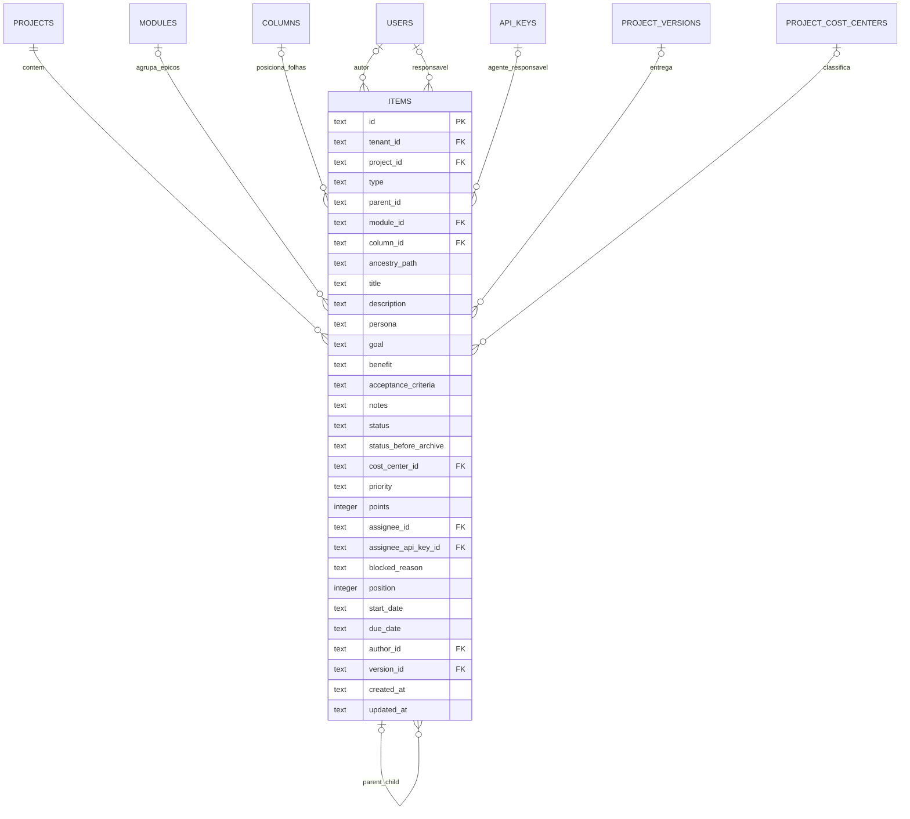
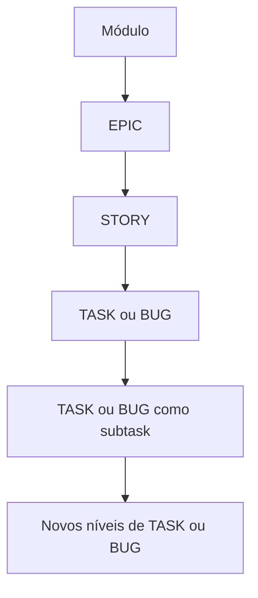
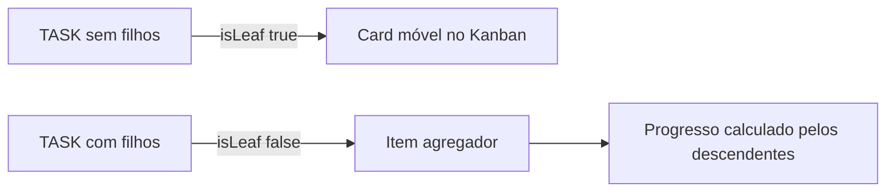

# Modelo - Itens e Hierarquia

`items` é a entidade central do trabalho. Um discriminante define se o registro é épico, história, task ou bug; a auto-relação por `parent_id` forma toda a árvore.

## `items`

A tabela reúne os campos comuns e os atributos específicos de cada tipo de trabalho. Campos não aplicáveis ao tipo permanecem nulos e são controlados pela camada de domínio.

### Diagrama central



## Identidade e escopo

| Campo | Obrigatório | Descrição |
|---|---:|---|
| `id` | Sim | UUID e chave primária. |
| `tenant_id` | Sim | Tenant do item. |
| `project_id` | Sim | Projeto proprietário. |
| `type` | Sim | `EPIC`, `STORY`, `TASK` ou `BUG`. |
| `title` | Sim | Nome do item. |
| `description` | Não | Descrição em rich text. |
| `created_at` | Sim | Data de criação. |
| `updated_at` | Sim | Data da última alteração. |

O trio `tenant_id`, `project_id` e `id` delimita o item nas operações da API. Relações selecionadas por ID também são validadas no mesmo contexto.

## Hierarquia

| Campo | Obrigatório | Descrição |
|---|---:|---|
| `parent_id` | Não | Identificador lógico do item pai. |
| `module_id` | Depende | Obrigatório para épicos; aponta para `modules`. |
| `ancestry_path` | Sim | JSON com `{ id, title, type }` dos ancestrais. |

Estrutura permitida:



| Tipo | Pai permitido | Módulo |
|---|---|---|
| `EPIC` | Nenhum | Obrigatório. |
| `STORY` | `EPIC` | Herdado pelo caminho. |
| `TASK` | `STORY`, `TASK`, `BUG` ou nenhum | Herdado pelo contexto. |
| `BUG` | `STORY`, `TASK`, `BUG` ou nenhum | Herdado pelo contexto. |

`parent_id` é uma relação lógica configurada no ORM, mas não possui foreign key física declarada no schema atual. A camada de aplicação é responsável por validar existência, tipo do pai, projeto, tenant e ausência de ciclos; nem todas essas garantias podem ser delegadas ao banco no modelo atual.

## Caminho desnormalizado

`ancestry_path` evita percorrer recursivamente todos os pais para formar breadcrumbs e árvore. Exemplo:

```json
[
  { "id": "epic-id", "title": "Autenticação", "type": "EPIC" },
  { "id": "story-id", "title": "Login", "type": "STORY" }
]
```

Ao mover um item na hierarquia ou renomear um ancestral, a aplicação precisa recalcular o caminho dos descendentes para manter o valor coerente.

## Campos editoriais

| Campo | Uso principal | Descrição |
|---|---|---|
| `persona` | `STORY` | Conteúdo de **Como**. |
| `goal` | `STORY` | Conteúdo de **Eu quero**. |
| `benefit` | `STORY` | Conteúdo de **Para que**. |
| `acceptance_criteria` | `STORY` | Critérios verificáveis. |
| `notes` | `STORY` | Observações complementares. |

O schema permite valores nulos e a aplicação decide quais campos apresentar conforme `type`.

## Estado operacional

| Campo | Obrigatório | Descrição |
|---|---:|---|
| `column_id` | Não | Coluna do Board para item operacional. |
| `status` | Sim | Estado funcional atual. |
| `status_before_archive` | Não | Estado preservado durante arquivamento. |
| `priority` | Sim | `LOW`, `MEDIUM`, `HIGH` ou `CRITICAL`. |
| `points` | Não | Estimativa ou valor agregado. |
| `blocked_reason` | Não | Motivo do bloqueio. |
| `position` | Sim | Ordem dentro do contexto visual. |
| `start_date` | Não | Data de início. |
| `due_date` | Não | Data limite. |

`status` aceita `NOT_STARTED`, `IN_PROGRESS`, `BLOCKED`, `DONE`, `CANCELLED` e `ARCHIVED`.

Ao arquivar, o valor anterior vai para `status_before_archive`; ao restaurar, esse valor volta para `status` e o campo auxiliar é limpo.

## Responsabilidade e autoria

| Campo | Obrigatório | Descrição |
|---|---:|---|
| `author_id` | Não | Usuário que criou o item. |
| `assignee_id` | Não | Usuário responsável pela execução. |
| `assignee_api_key_id` | Não | API Key do agente que reivindicou o item. |

`author_id` é imutável pelo formulário. `assignee_id` pode apontar para uma pessoa; em um claim de agente, aponta para o proprietário humano e `assignee_api_key_id` preserva a identidade específica do agente.

Liberar o item limpa os dois campos de responsabilidade associados ao claim.

## Planejamento e classificação

| Campo | Obrigatório | Descrição |
|---|---:|---|
| `version_id` | Não | Versão prevista de entrega. |
| `cost_center_id` | Não | Centro de custo. |

Sprints e tags não ocupam colunas diretas em `items`; usam tabelas de associação muitos para muitos. Isso permite múltiplas tags e preservar participação em diferentes sprints.

## Aplicabilidade por tipo

| Grupo de campos | Épico | História | Task/Bug folha | Task/Bug agregador |
|---|---:|---:|---:|---:|
| Título e descrição | Sim | Sim | Sim | Sim |
| `module_id` | Sim | Não direto | Não direto | Não direto |
| Narrativa ágil | Não | Sim | Não | Não |
| Coluna e posição no Kanban | Não | Não | Sim | Não |
| Status | Sim | Sim | Sim | Sim |
| Prioridade e datas | Opcional | Opcional | Sim | Sim |
| Pontos próprios | Opcional | Opcional | Sim | Sim |
| Progresso agregado | Sim | Sim | Não | Sim |
| Versão | Sim | Sim | Sim | Sim |
| Centro de custo | Não | Sim | Sim | Sim |

## Leaf Rule

A `TASK` ou `BUG` é folha quando nenhum item aponta para seu ID em `parent_id`.



Criar a primeira subtask transforma o pai em agregador. Excluir ou mover filhos pode alterar novamente essa condição, por isso `isLeaf` é calculado e não persistido como coluna.

## Progresso e pontos

Para agregadores, pontos totais e concluídos são derivados dos descendentes. O registro mantém os pontos próprios, mas o valor apresentado pode ser uma agregação calculada.

Checklists possuem progresso independente e não mudam automaticamente os pontos do item.

## Ciclo de exclusão e arquivamento

- **Arquivamento:** altera status e preserva a árvore.
- **Restauração:** recupera o status anterior e os ancestrais necessários.
- **Exclusão:** percorre descendentes, remove tabelas de associação e dependências e então remove os itens.
- **Exclusão de módulo em cascata:** parte dos épicos do módulo e aplica a mesma travessia aos descendentes.

Consulte [[10 - Referencia/Modelo - Integridade e Cascatas|Integridade e cascatas]] para a ordem completa.

## Funcionalidades relacionadas

- [[10 - Referencia/Modelo de Dados|Modelo de dados]]
- [[03 - Estrutura do Trabalho/Hierarquia dos Itens|Hierarquia dos itens]]
- [[03 - Estrutura do Trabalho/Leaf Rule e Itens Agregadores|Leaf Rule e itens agregadores]]
- [[04 - Board e Visualizacoes/Arquivar Restaurar e Excluir Itens|Arquivar, restaurar e excluir itens]]
- [[10 - Referencia/Modelo - Entidades Complementares|Entidades complementares]]
