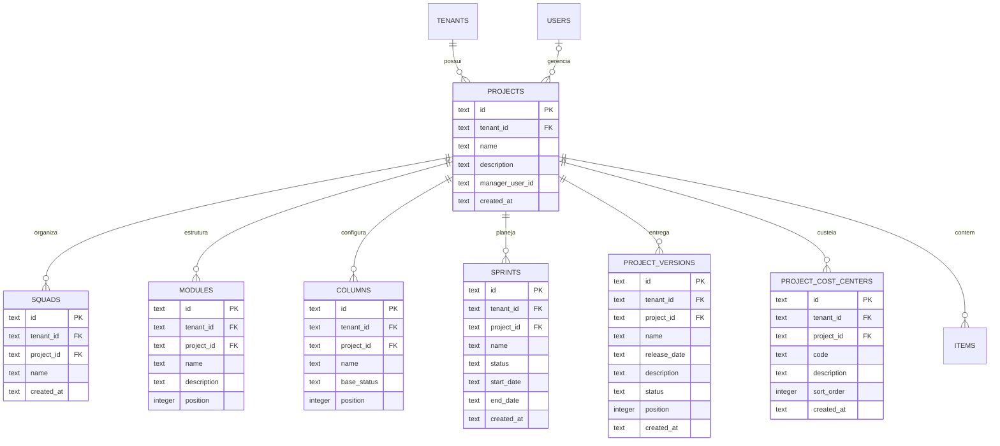
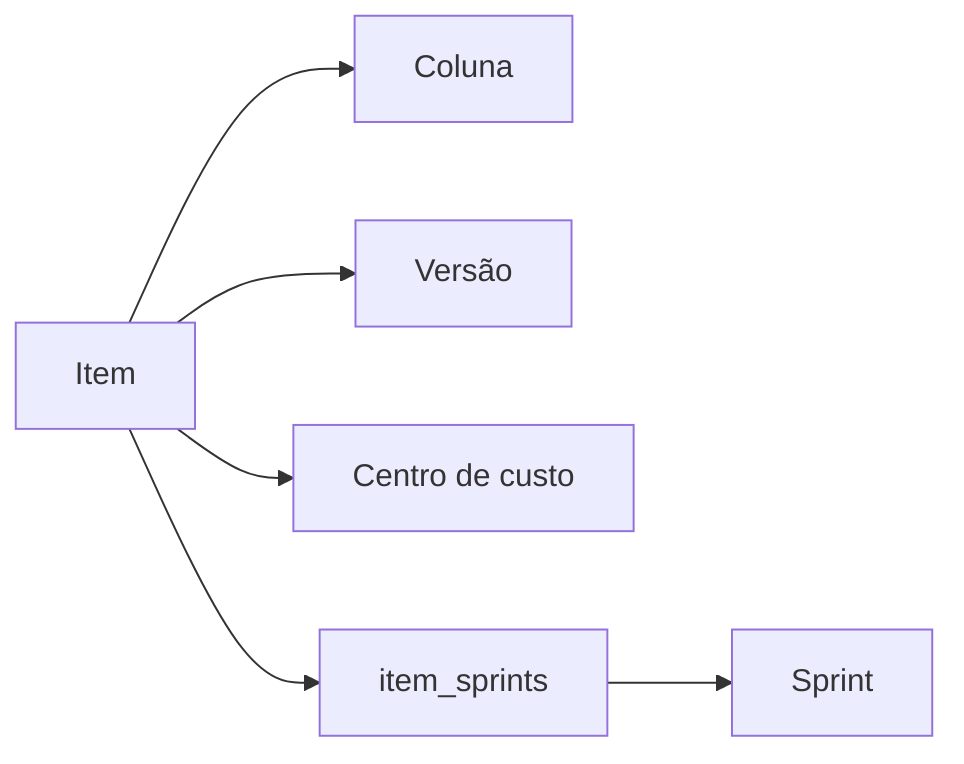

# Modelo - Projetos e Planejamento

O projeto é o limite operacional do Board. A ele pertencem squads, módulos, colunas, sprints, versões, centros de custo, participantes e itens.

## Diagrama

## `projects`

Raiz do espaço de trabalho.

| Campo | Obrigatório | Descrição |
|---|---:|---|
| `id` | Sim | UUID e chave primária. |
| `tenant_id` | Sim | Tenant proprietário. |
| `name` | Sim | Nome exibido no portfólio e no Board. |
| `description` | Não | Contexto geral do projeto. |
| `board_mode` | Sim | `HIERARCHICAL` ou `SIMPLE`. |
| `simple_story_id` | Não | História fixa usada no modo `SIMPLE`. |
| `is_restricted` | Sim | Restringe o projeto a membros e ao gerente (padrão `false`). |
| `is_hidden` | Sim | Oculta o projeto das listagens (padrão `false`). |
| `manager_user_id` | Não | Gerente geral, com função informativa. |
| `start_date` | Não | Data de início do projeto. |
| `planned_end_date` | Não | Data de término prevista. |
| `planned_points` | Não | Estimativa de pontos do escopo. |
| `planned_hours` | Não | Estimativa de horas do escopo. |
| `scope` | Não | Escopo do projeto em texto rico. |
| `created_at` | Sim | Data de criação. |

O gerente precisa ser membro do projeto, mas essa validação é lógica; o campo não declara foreign key física no schema atual. Na criação, quando o gerente não é informado, o criador do projeto assume a função.

## `squads`

Agrupamentos organizacionais internos ao projeto.

| Campo | Obrigatório | Descrição |
|---|---:|---|
| `id` | Sim | UUID e chave primária. |
| `tenant_id` | Sim | Tenant do squad. |
| `project_id` | Sim | Projeto proprietário. |
| `name` | Sim | Nome da equipe. |
| `created_at` | Sim | Data de criação. |

Os membros se associam ao squad por `memberships.squad_id`. Excluir o squad limpa esse campo sem remover os membros do projeto.

## `modules`

Primeiro nível funcional abaixo do projeto.

| Campo | Obrigatório | Descrição |
|---|---:|---|
| `id` | Sim | UUID e chave primária. |
| `tenant_id` | Sim | Tenant do módulo. |
| `project_id` | Sim | Projeto proprietário. |
| `name` | Sim | Nome funcional. |
| `description` | Não | Escopo do módulo. |
| `position` | Sim | Ordem nas listas e filtros. |

Épicos apontam para módulos por `items.module_id`. Ao remover um módulo em uso, a aplicação exige transferência dos épicos ou exclusão em cascata.

## `columns`

Etapas configuráveis do Kanban.

| Campo | Obrigatório | Descrição |
|---|---:|---|
| `id` | Sim | UUID e chave primária. |
| `tenant_id` | Sim | Tenant da coluna. |
| `project_id` | Sim | Projeto proprietário. |
| `name` | Sim | Nome visível no Board. |
| `base_status` | Sim | Status funcional representado. |
| `position` | Sim | Ordem horizontal. |

`base_status` aceita `NOT_STARTED`, `IN_PROGRESS`, `BLOCKED`, `DONE` ou `CANCELLED`. `ARCHIVED` não é status de coluna.

Itens folha apontam para uma coluna por `items.column_id`. A movimentação sincroniza `items.status` com o status base do destino.

## `sprints`

Ciclos temporais de execução.

| Campo | Obrigatório | Descrição |
|---|---:|---|
| `id` | Sim | UUID e chave primária. |
| `tenant_id` | Sim | Tenant da sprint. |
| `project_id` | Sim | Projeto proprietário. |
| `name` | Sim | Nome do ciclo. |
| `status` | Sim | `PROPOSED`, `OPEN` ou `CLOSED`. |
| `start_date` | Sim | Início planejado. |
| `end_date` | Sim | Fim planejado. |
| `created_at` | Sim | Data de criação. |

Itens e sprints têm relação muitos para muitos por `item_sprints`. A aplicação garante que somente uma sprint fique aberta por projeto; abrir uma sprint rebaixa a anterior para `PROPOSED`, e sprints encerradas rejeitam novas associações de itens.

## `project_versions`

Releases ou entregas previstas.

| Campo | Obrigatório | Descrição |
|---|---:|---|
| `id` | Sim | UUID e chave primária. |
| `tenant_id` | Sim | Tenant da versão. |
| `project_id` | Sim | Projeto proprietário. |
| `name` | Sim | Nome da versão. |
| `release_date` | Não | Data prevista ou efetiva. |
| `description` | Não | Conteúdo ou objetivo da entrega. |
| `status` | Sim | `PLANNED`, `IN_DEV`, `RELEASED` ou `CANCELLED`. |
| `position` | Sim | Ordem de exibição. |
| `created_at` | Sim | Data de criação. |

Um item aponta opcionalmente para uma versão por `items.version_id`. Ao excluir a versão, os itens permanecem e perdem somente o vínculo.

## `project_cost_centers`

Classificações financeiras do trabalho.

| Campo | Obrigatório | Descrição |
|---|---:|---|
| `id` | Sim | UUID e chave primária. |
| `tenant_id` | Sim | Tenant do centro de custo. |
| `project_id` | Sim | Projeto proprietário. |
| `code` | Sim | Código de até 20 caracteres. |
| `description` | Não | Descrição de até 200 caracteres. |
| `sort_order` | Sim | Ordem e prioridade para atribuição padrão. |
| `created_at` | Sim | Data de criação. |

`items.cost_center_id` é opcional. Na criação de itens elegíveis, a aplicação pode preencher o primeiro centro de custo da ordem. Um centro em uso não pode ser removido antes da reatribuição.

## Relações de planejamento do item

- Coluna indica a etapa operacional atual.
- Sprint indica participação em um ou mais ciclos.
- Versão indica a entrega prevista.
- Centro de custo indica classificação financeira.

Esses vínculos são independentes e podem coexistir no mesmo item.

## Criação inicial do projeto

Ao criar um projeto, a aplicação também cria:

- o membership `ADMIN` do criador;
- no modo `HIERARCHICAL`, o módulo padrão **Geral**;
- no modo `SIMPLE`, a história fixa **Fluxo contínuo**;
- as colunas padrão do fluxo.

Sprints, versões, squads e centros de custo são adicionados conforme a necessidade.

## Funcionalidades relacionadas

- [[10 - Referencia/Modelo de Dados|Modelo de dados]]
- [[07 - Configuracoes do Projeto/Configuracoes do Projeto|Configurações do projeto]]
- [[02 - Projetos/Estrutura Inicial de um Projeto|Estrutura inicial de um projeto]]
- [[10 - Referencia/Modelo - Itens e Hierarquia|Itens e hierarquia]]

