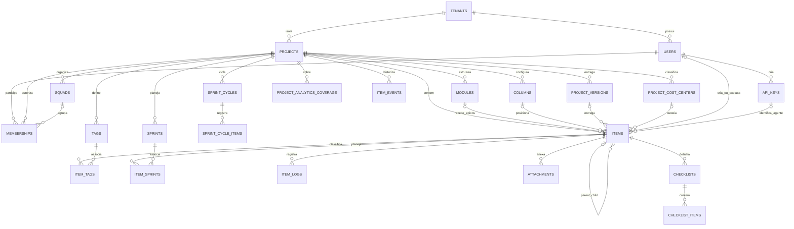
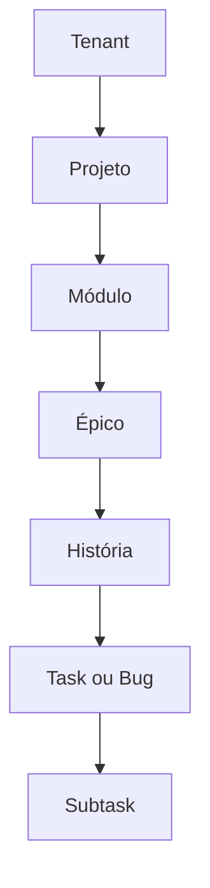

# Modelo de Dados

O modelo do Azy Board é organizado em torno de três raízes: o tenant delimita o ambiente organizacional, o projeto delimita o espaço de trabalho e `items` unifica todos os níveis de entrega, de épicos a subtasks.

Esta referência descreve o schema atual da API, suas relações lógicas e as regras de integridade aplicadas pelo banco ou pela aplicação.

## Como navegar pelo mapa

- [[10 - Referencia/Modelo - Identidade e Acesso|Identidade e acesso]]
- [[10 - Referencia/Modelo - Projetos e Planejamento|Projetos e planejamento]]
- [[10 - Referencia/Modelo - Itens e Hierarquia|Itens e hierarquia]]
- [[10 - Referencia/Modelo - Entidades Complementares|Entidades complementares]]
- [[10 - Referencia/Modelo - Integridade e Cascatas|Integridade, isolamento e cascatas]]

## Visão global

## Inventário das tabelas

O schema possui 19 tabelas:

| Domínio | Tabelas |
|---|---|
| Identidade e acesso | `tenants`, `users`, `api_keys`, `memberships` |
| Projeto e planejamento | `projects`, `squads`, `modules`, `columns`, `sprints`, `project_versions`, `project_cost_centers` |
| Trabalho | `items` |
| Classificação e ciclos | `tags`, `item_tags`, `item_sprints` |
| Conteúdo e auditoria | `item_logs`, `attachments`, `checklists`, `checklist_items` |
| Analytics do Dashboard | `project_analytics_coverage`, `item_events`, `sprint_cycles`, `sprint_cycle_items` |

`item_events` é append-only e preserva snapshots mínimos após a exclusão de itens. `item_sprints` usa associação única por par `(item_id, sprint_id)` após deduplicação auditada.

## Fluxo estrutural principal

`EPIC`, `STORY`, `TASK` e `BUG` não possuem tabelas separadas. Todos são registros de `items`, diferenciados por `type` e ligados por `parent_id`.

## Convenções físicas

| Convenção | Implementação atual |
|---|---|
| Banco | SQLite, acessado por Drizzle ORM. |
| Identificadores | UUID v4 armazenado como `TEXT`. |
| Datas e horários | ISO 8601 armazenado como `TEXT`. |
| Booleanos | `INTEGER` em modo booleano no SQLite. |
| Enums | `TEXT` restringido pelo tipo da aplicação e, em algumas migrations, por `CHECK`. |
| Campos estruturados | `ancestry_path` armazena JSON serializado como `TEXT`. |
| Multi-tenancy | `tenant_id` repetido nas entidades de negócio e aplicado em todas as consultas sensíveis. |

## Relações físicas e lógicas

Nem toda linha do mapa representa uma foreign key declarada no banco:

- **FK física:** declarada pelo schema/migration, como `items.project_id -> projects.id`.
- **Relação lógica:** conhecida pelo ORM ou pela regra de domínio, como `items.parent_id -> items.id`.
- **Regra da aplicação:** validada nas rotas, como pertencer ao mesmo tenant ou transferir épicos antes de excluir um módulo.

A página [[10 - Referencia/Modelo - Integridade e Cascatas|Integridade e cascatas]] diferencia essas garantias.

## Entidade central

`items` concentra:

- tipo e hierarquia;
- campos editoriais de épicos e histórias;
- estado operacional de tasks e bugs;
- responsáveis humanos ou agentes;
- planejamento por coluna, sprint e versão;
- classificação por tags e centro de custo;
- anexos, checklists e histórico.

Essa unificação permite navegar a árvore com uma auto-relação e aplicar regras comuns de auditoria e ciclo de vida.

## Fontes do mapa

O mapa foi derivado de:

- `apps/api/src/db/schema.ts`;
- migrations `0000` a `0004`;
- relações Drizzle;
- rotas que implementam integridade transacional e cascatas;
- tipos de domínio compartilhados em `packages/types`.

> [!info] Escopo visual
> Este mapa usa diagramas Mermaid renderizados pelo Obsidian. Capturas da aplicação continuam fora da etapa atual.

## Funcionalidades relacionadas

- [[03 - Estrutura do Trabalho/Hierarquia dos Itens|Hierarquia dos itens]]
- [[10 - Referencia/Perfis e Permissoes|Perfis e permissões]]
- [[10 - Referencia/Tipos Status e Prioridades|Tipos, status e prioridades]]
